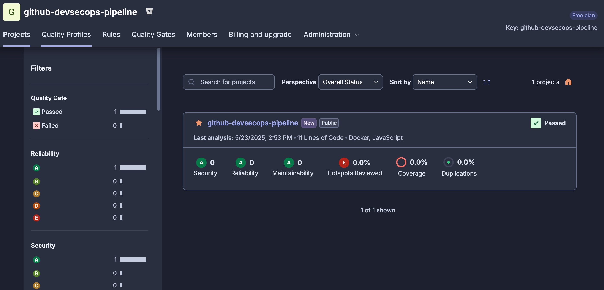
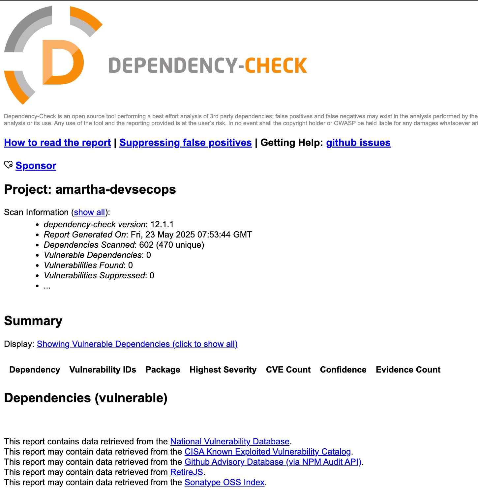
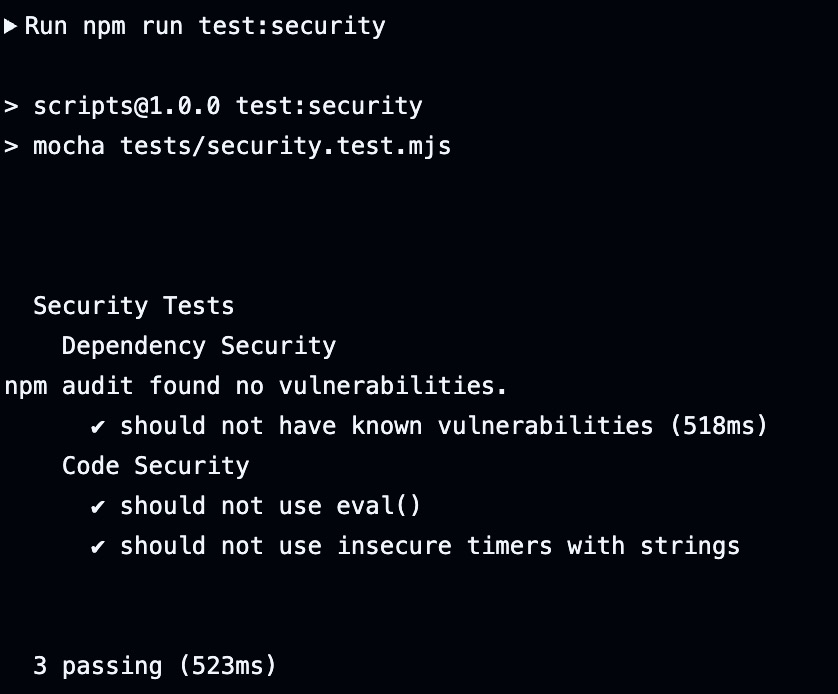
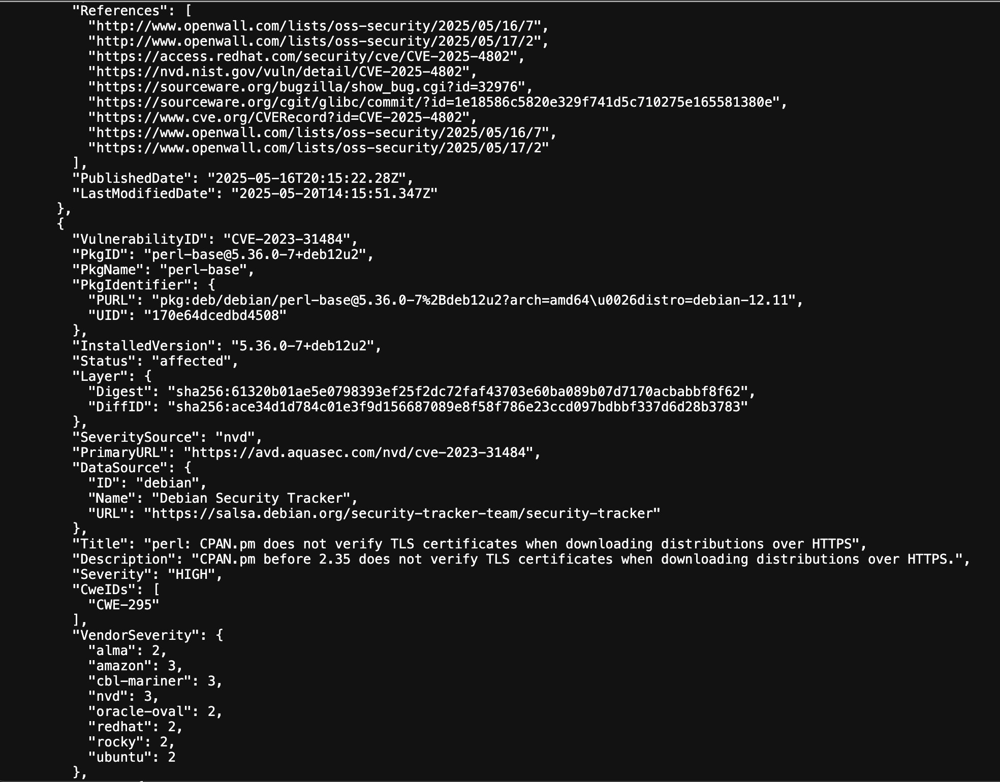
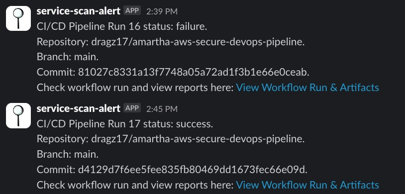
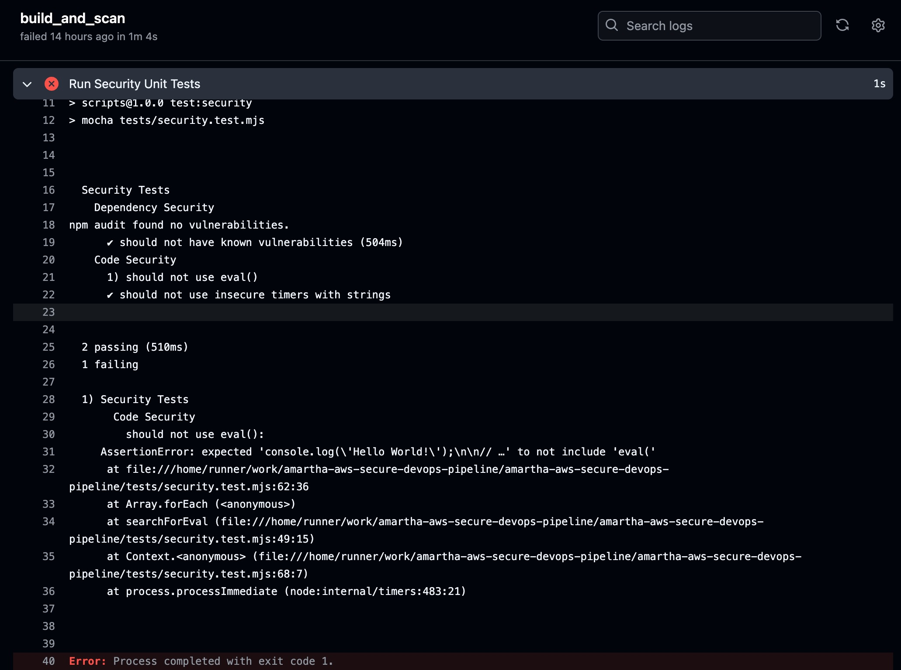
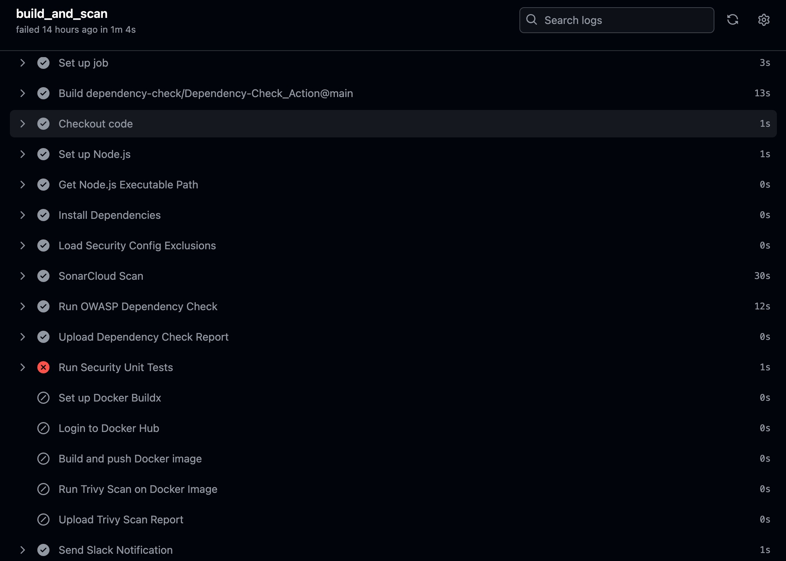

# Amartha DevSecOps Pipeline

This repository contains a DevSecOps pipeline implementation that integrates security tools and best practices into the CI/CD process for Node.js web applications.

## Features

- Automated security scanning in CI/CD pipeline
- Static code analysis (SonarCloud)
- Dependency vulnerability checking (OWASP Dependency-Check)
- Container security scanning (Trivy)
- Security unit tests
- Automated notifications (Slack)

## Prerequisites

- Node.js 18 or higher
- Docker (Colima/Docker Desktop)
- GitHub account
- SonarCloud account
- NVD API key
- Container Registry

## Setup

1. Clone the repository:
   ```bash
   git clone https://github.com/dragz17/amartha-secure-devops-pipeline.git
   cd amartha-secure-devops-pipeline
   ```

2. Install dependencies:
   ```bash
   npm install
   ```

3. Configure security settings:
   - Edit `config/security-config.json` to customize security thresholds and notifications
   - Update `.gitignore` and `.dockerignore` to exclude sensitive files

4. Set up GitHub:
   - Add required secrets in repository settings

## Security Tools Integration

### Static Code Analysis
- SonarCloud for code quality and security

### Dependency Checking
- OWASP Dependency-Check

### Container Security
- Trivy for container scanning
- Docker best practices

## Pipeline Stages

1. **Security Scan**
   - Static code analysis (SonarCloud)
   - Dependency check (OWASP Dependency-Check)
   - Container scan (Trivy)
   - Security unit tests

2. **Build**
   - Docker image build
   - Application build

## Running Security Tests

```bash
# Run all security tests
npm run test:security
```

## Notifications

The pipeline sends notifications for:
- Critical vulnerabilities
- High severity issues
- Failed security checks

## Output

- Static Code Analysis

- Dependency Check

- Security Unit Test

- Container Scanning

- Slack Notification

- Scan failed to pass



## Thank You
Regards, Boy Suganda Sinaga